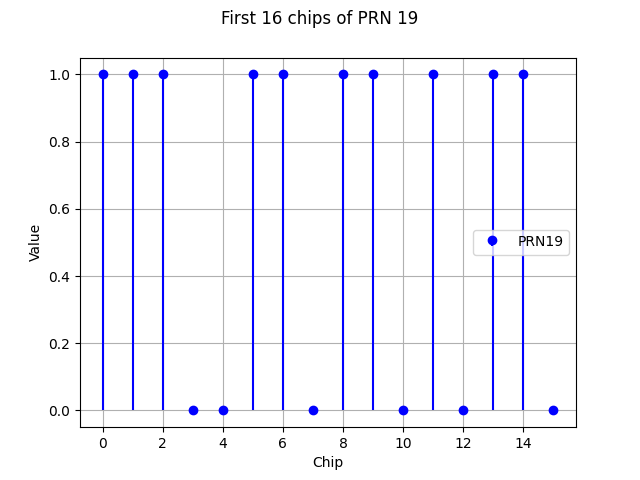
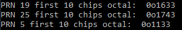
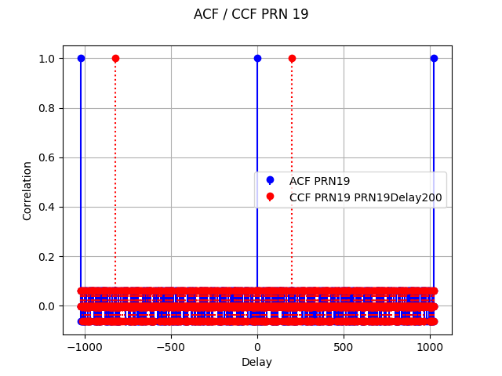
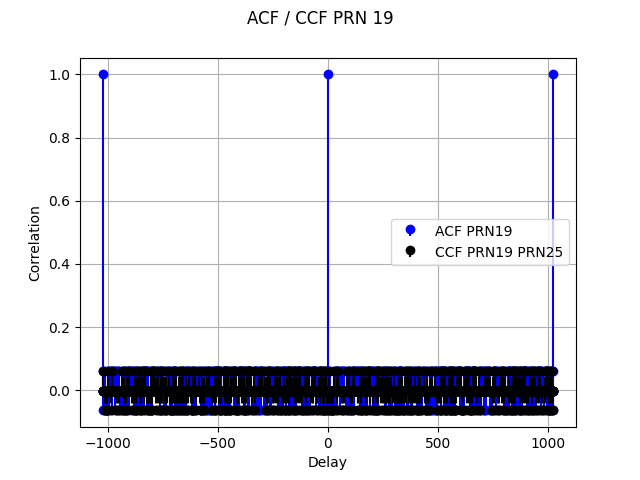
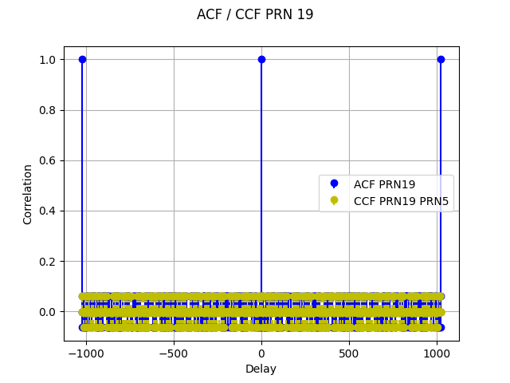
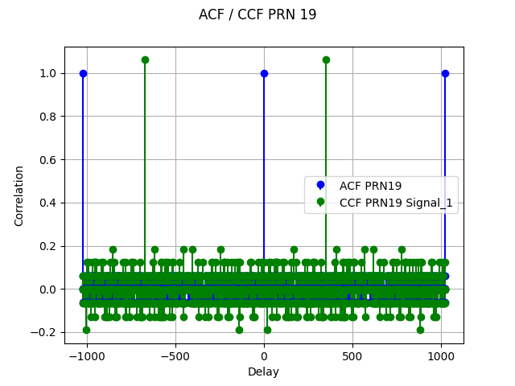
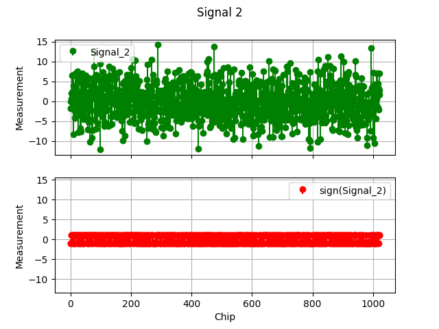
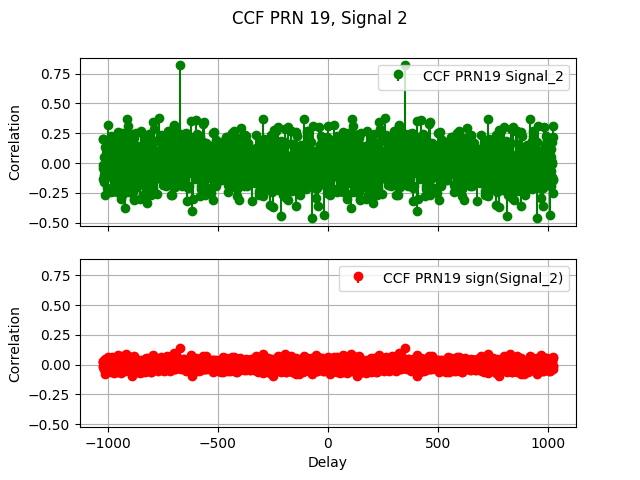

# GNSS Rechnerübung 2

## **a.**

## **b.**
  
Der Vektor ist gleich dem Vektor aus der vorhergehenden Aufgabe, wie in dem Plot zu erkennen(Difference=0).
## **c/d.**
  
Korrekt!
## **e/f.**
  
Die Spitze ist wie erwartet um 200 chips zur AKF von PRN 19 verschoben.
## **g.**
  
Die Kreuzkorrelationsfunktion zeigt die Ähnlichkeiten von PRN 19 und PRN 25, hier ist zu erkennen, dass sich die sequenzen nicht wiederholen, da keine Spitzen auftreten. Die AKF (aus e.) zeigt die Ähnlichkeiten mit sich selbst, daher die Spitzen bei 1023(Sequenz wiederholt sich).
## **h.**

Die Kreuzkorrelationsfunktion zeigt die Ähnlichkeiten von PRN 19 und PRN 5, hier ist zu erkennen, dass sich die sequenzen nicht wiederholen, da keine Spitzen auftreten. Die AKF (aus e.) zeigt die Ähnlichkeiten mit sich selbst, daher die Spitzen bei 1023(Sequenz wiederholt sich).
## **i.**
  
Die Spitzen sind wie erwartet um 350 Chips von den Spitzen der AKF von PRN 19 verschoben, da PRN 19 um 350 Chips verzögert wurde. Der Einfluss von PRN 5 und PRN 25 ist schwer aus diesen Plots herauszulesen.
## **k/l.**
  
  
Es ist immer noch eine Spitze bei 350(650) zu erkennen. Der Gold-Code zeigt hier seine Stärke.  
Selbst nach sign() sind die Spitzen noch erkennbar, jedoch deutlich schwächer.  
SNR Correlation Signal_2 in dB:  **15.360882803307023**  
SNR Correlation sign(Signal_2) in dB:  **13.10961409167924**  
Die SNR hat sich um nur ~2 dB verschlechtert. Die Korrelation kann also bei Empfang des Signals im Digitalen nach der A/D Umsetzung berechnet werden.
