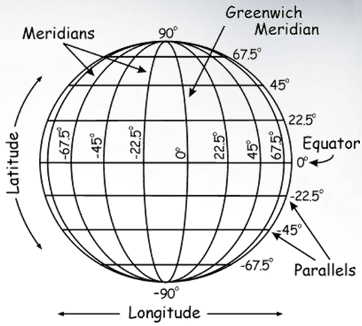

---

title: ellipsoid model

---

# Ellipsoid model

## Spherical model
A simple but not accurate model of a planet is a sphere.

<figure>
  
  <figcaption>Sphere model</figcaption>
</figure>

The radius $r_{0}$ of earth is $6371 \,\mathrm{km}$. Thus via $d = 2\pi r$ the diameter $d$ can can be calculated to $d = 40030 \,\mathrm{km}$. We first want to calculate how much uncertainty there is when given a certain longitude and latitude. The uncertainty in longitude is highest on the equator because the diameter is highest. The longitude can take on the values $[-180°;180°]$. This means when given a longitude with accuracy of $1°$ one can get the uncertainty of measurement $\Delta d$ with $\Delta d = \frac{d}{360}$. So on the equator $\Delta d$ is $111.2 \,\mathrm{km}$. At the poles $\Delta d$ is zero because $d$ is zero. To calculate the $\Delta d$s inbetween we first need to get the diameters at certain latitudes.

To get the diameter of the circle at a certain latitude $\alpha$ we first calculate the radius $r$ with,

\begin{equation}
r(\alpha) =r_{0} \cos{(\alpha)}.
\end{equation}

So to get the uncertainty at a specific [earth coordinate](earth_coord.md)
